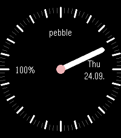

# Varv

24-hour one-hand watchface for Pebble Time 2 (emery, 200x228), after the
look of [Nifty](https://apps.repebble.com/nifty_564a21274f9b298767000067) by
Fnord Prefect. One long white hand that turns once a day, 12:00 at the top and
00:00 at the bottom. Quarter-hour ticks with white hour marks, bigger at 0, 6,
12 and 18.



Around the hand:

- Battery percentage on the left.
- Weekday and date on the right.
- "pebble" at the top, which changes to "no link" when the phone connection
  is lost (with a double vibration) and "quiet" during quiet time.

No settings. Nifty's source is not public, so this is a re-creation from its
screenshot, not a code fork.

## Build and install

```
pebble build
pebble install --emulator emery
pebble install --phone <phone ip>     # developer connection on in the Pebble app
```

The bundle is `build/varv.pbw`; it can also be sideloaded from the phone.

## Store listing

The appstore description is in `DESCRIPTION.txt`.
